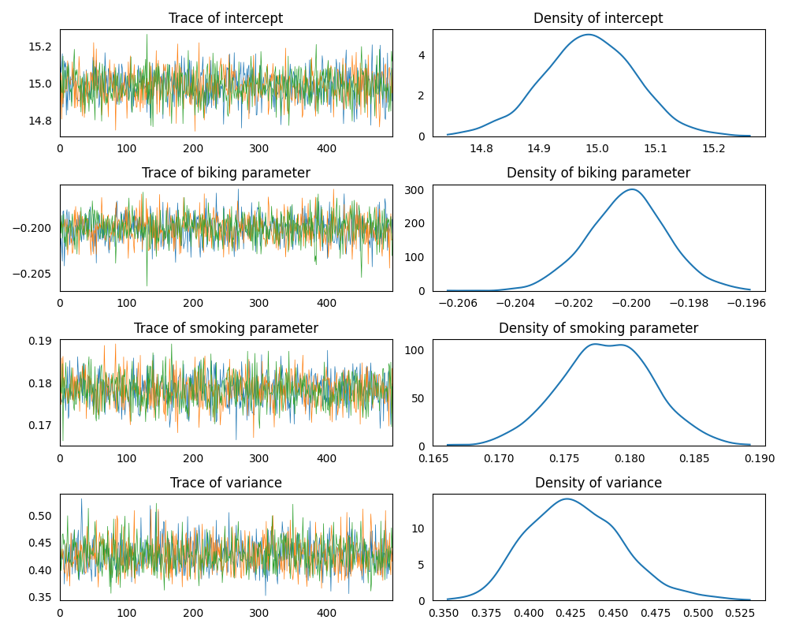
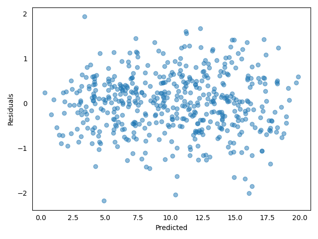

### Model Set Up

Determine the effect that the independent variables *biking* and 
*smoking* have on the dependent variable *heart disease* using a 
multiple linear regression model.  
[Link to the dataset](https://github.com/AndreaBlengino/baypy/blob/master/examples/heart/data/data.csv)  
Unfortunately, [the database original source](https://www.scribbr.com/statistics/multiple-linear-regression/)
does not report the units on each variable.

```python
import pandas as pd

data = pd.read_csv(r'data/data.csv')
```

Set up a multiple linear regression model, considering *biking* and
*smoking* as regressors and *heart disease* as the response variable. 
Use non-informative priors for regressors and variance:

```python
from baypy.model import LinearModel
import baypy as bp

model = LinearModel()

model.data = data
model.response_variable = 'heart disease'
model.priors = {'intercept': {'mean': 0, 'variance': 1e6},
                'biking': {'mean': 0, 'variance': 1e9},
                'smoking': {'mean': 0, 'variance': 1e9},
                'variance': {'shape': 1, 'scale': 1e-9}}
```

### Sampling

Run the regression sampling on 3 Markov chains, with 500 iterations per 
each chain and discarding the first 50 burn-in draws:

```python
from baypy.regression import LinearRegression

LinearRegression.sample(model = model, n_iterations = 500, 
                        burn_in_iterations = 50, n_chains = 3, seed = 137)
```

### Convergence Diagnostics

Asses the model convergence diagnostics:

```python
bp.diagnostics.effective_sample_size(posteriors = model.posteriors)
```

```text
                       intercept   biking  smoking  variance
Effective Sample Size    1389.56  1449.73  1362.26   1426.75
```
```python
bp.diagnostics.autocorrelation_summary(posteriors = model.posteriors)
```

```text
        intercept    biking   smoking  variance
Lag 0    1.000000  1.000000  1.000000  1.000000
Lag 1   -0.025015 -0.021166  0.009275 -0.021082
Lag 5    0.027681 -0.007564  0.046201  0.030989
Lag 10   0.015334  0.014290  0.043676 -0.057992
Lag 30  -0.041058 -0.008922 -0.013752 -0.040056
```

```python
bp.diagnostics.autocorrelation_plot(posteriors = model.posteriors)
```


All diagnostics show a low correlation, indicating the chains 
converged to the stationary distribution.

### Posteriors Analysis

Asses posterior analysis:

```python
bp.analysis.trace_plot(posteriors = model.posteriors)
```



Traces are quite good, incidating draws from the stationary 
distribution.

```python
bp.analysis.residuals_plot(model = model)
```



Also the residuals plot is good: no evidence for patterns, shapes or 
outliers.

```python
bp.analysis.summary(posteriors = model.posteriors)
```

```text
Number of chains:           3
Sample size per chian:    500

Empirical mean, standard deviation, 95% HPD interval for each variable:

                Mean        SD    HPD min    HPD max
intercept  14.985169  0.079494  14.811145  15.126328
biking     -0.200122  0.001387  -0.203015  -0.197531
smoking     0.178261  0.003535   0.171384   0.185280
variance    0.427870  0.027745   0.374502   0.480325

Quantiles for each variable:

                2.5%        25%        50%        75%      97.5%
intercept  14.822835  14.933689  14.986087  15.039621  15.141583
biking     -0.202909  -0.201028  -0.200086  -0.199219  -0.197334
smoking     0.171140   0.175893   0.178261   0.180621   0.185169
variance    0.380265   0.408345   0.426025   0.446627   0.488800
```

The summary reports a statistical evidence for:

- negative effect of *biking*: `$1$` point increase in *biking* 
would result in `$0.2$` points decrease in *heart disease*
- positive effect of *smoking*: `$1$` point increase in *smoking* 
would result `$0.18$` points increase in *heart disease*
