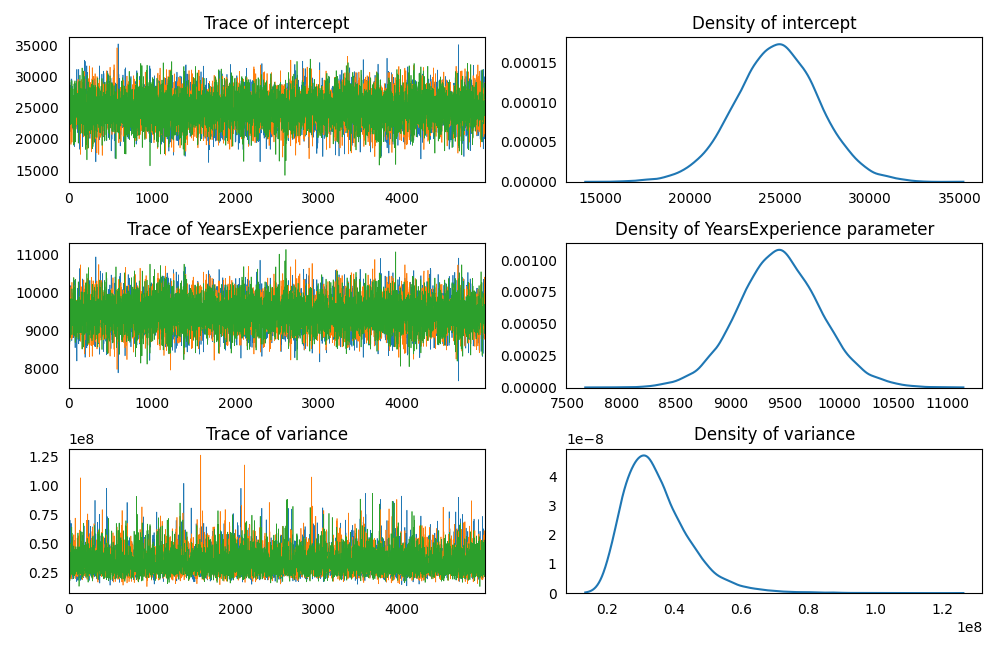
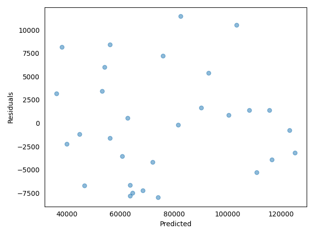
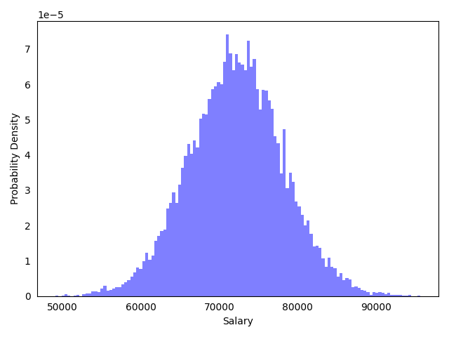
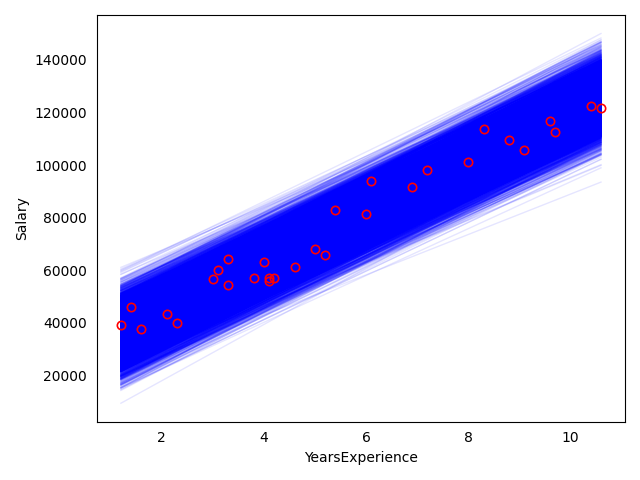

### Model Set Up

Determine the effect of the years of experience on salary of jobholders 
using a simple linear regression model.  
[Link to the dataset](https://github.com/AndreaBlengino/baypy/blob/master/docs/source/examples/salary/data/data.csv)  
[Dataset original source](https://www.kaggle.com/datasets/rsadiq/salary)

```python
import pandas as pd

data = pd.read_csv(r'data/data.csv')
```

Set up a linear regression model, considering *YearsExperience* as the
regressor and *Salary* as the response variable.  
Using non-informative priors for regressors and variance:

```python
from baypy.model import LinearModel
import baypy as bp

model = LinearModel()
model.data = data
model.response_variable = 'Salary'
model.priors = {'intercept': {'mean': 0, 'variance': 1e12},
                'YearsExperience': {'mean': 0, 'variance': 1e12},
                'variance': {'shape': 1, 'scale': 1e-12}}
```

### Sampling

Run the regression sampling on 3 Markov chains, with 5000 iterations per 
each chain and discarding the first 50 burn-in draws:

```python
from baypy.regression import LinearRegression

regression = bp.regression.LinearRegression(model = model)
LinearRegression.sample(model = mode, n_iterations = 5000, 
                        burn_in_iterations = 50, n_chains = 3, seed = 137)
```

### Convergence Diagnostics

Asses the model convergence diagnostics:

```python
bp.diagnostics.effective_sample_size(posteriors = model.posteriors)
```

```text
                       intercept  YearsExperience  variance
Effective Sample Size   14757.25         14718.82  12692.31
```

```python
bp.diagnostics.autocorrelation_summary(posteriors = model.posteriors)
```

```text
        intercept  YearsExperience  variance
Lag 0    1.000000         1.000000  1.000000
Lag 1   -0.003427         0.003354  0.062828
Lag 5    0.014196         0.014811 -0.019225
Lag 10   0.002163         0.006671  0.008239
Lag 30  -0.000465        -0.002819  0.000682
```

```python
bp.diagnostics.autocorrelation_plot(posteriors = model.posteriors)
```


All diagnostics show a low correlation, indicating the chains 
converged to the stationary distribution.

### Posteriors Analysis

Asses posterior analysis:

```python
bp.analysis.trace_plot(posteriors = model.posteriors)
```



Traces are good, incidating draws from the stationary distribution.

```python
bp.analysis.residuals_plot(model = model)
```



Also the residuals plot is good: no evidence for patterns, shapes or 
outliers.

```python
bp.analysis.summary(posteriors = model.posteriors)
```

```text
Number of chains:           3
Sample size per chian:   5000

Empirical mean, standard deviation, 95% HPD interval for each variable:

                         Mean            SD       HPD min       HPD max
intercept        2.483031e+04  2.365229e+03  2.015569e+04  2.947465e+04
YearsExperience  9.453053e+03  3.863412e+02  8.702788e+03  1.022794e+04
variance         3.477599e+07  9.970182e+06  1.838234e+07  5.414517e+07

Quantiles for each variable:

                         2.5%           25%           50%           75%         97.5%
intercept        2.013048e+04  2.329292e+04  2.484871e+04  2.639967e+04  2.946356e+04
YearsExperience  8.696984e+03  9.198969e+03  9.447750e+03  9.703882e+03  1.022423e+04
variance         2.049029e+07  2.779544e+07  3.309215e+07  3.986484e+07  5.835968e+07
```

The summary reports a statistical evidence for a positive effect of 
years of experience: `$1$` year increase in experience would result in
`$\sim 9.500$` increase in salary.  
Predict the salary distribution for a jobholder with 5 year of 
experience, so the predictor is `YearsExperience = 5`:

```python
import matplotlib.pyplot as plt
import numpy as np

distribution = model.predict_distribution(predictors = {'YearsExperience': 5})

fig_2, ax_2 = plt.subplots()

ax_2.hist(distribution, bins = int(np.sqrt(len(distribution))), color = 'blue', alpha = 0.5, density = True)

ax_2.set_xlabel('Salary')
ax_2.set_ylabel('Probability Density')
ax_2.tick_params(bottom = False, top = False, left = False, right = False)

plt.tight_layout()

plt.show()
```



Comparing data to fitted model posteriors:

```python
posteriors_data = pd.DataFrame()
for posterior, posterior_sample in model.posteriors.items():
    posteriors_data[posterior] = np.asarray(posterior_sample).reshape(-1)
posteriors_data['error'] = np.random.normal(loc = 0, scale = np.sqrt(posteriors_data['variance']), size = len(posteriors_data))

years_experience = np.linspace(data['YearsExperience'].min(), data['YearsExperience'].max(), 50)


fig_1, ax_1 = plt.subplots()

for row in zip(*posteriors_data.to_dict('list').values()):
    salary = row[0] + row[1]*years_experience + row[3]
    ax_1.plot(years_experience, salary, color = 'blue', linewidth = 1, alpha = 0.1)
ax_1.plot(data['YearsExperience'].values, data['Salary'].values, marker = 'o', linestyle = '',
          markerfacecolor = 'none', markeredgecolor = 'red', markeredgewidth = 1.2)

ax_1.set_xlabel('YearsExperience')
ax_1.set_ylabel('Salary')
ax_1.tick_params(bottom = False, top = False, left = False, right = False)

plt.tight_layout()

plt.show()
```


