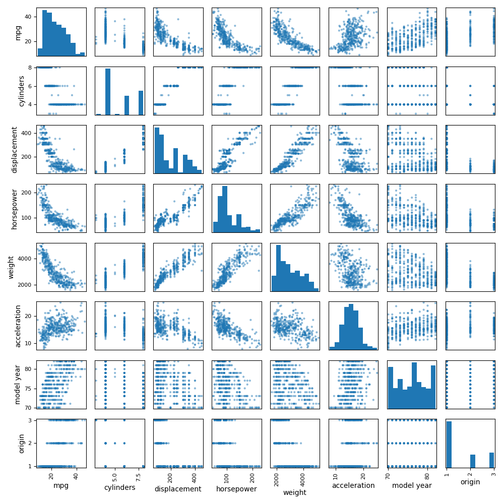
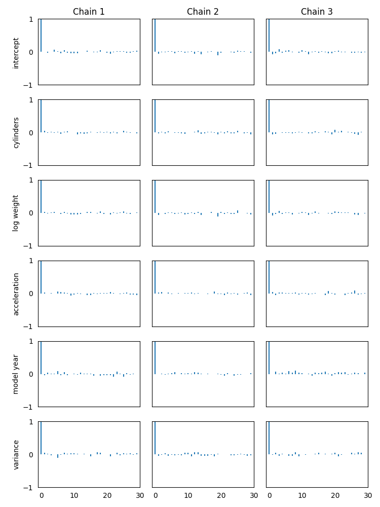
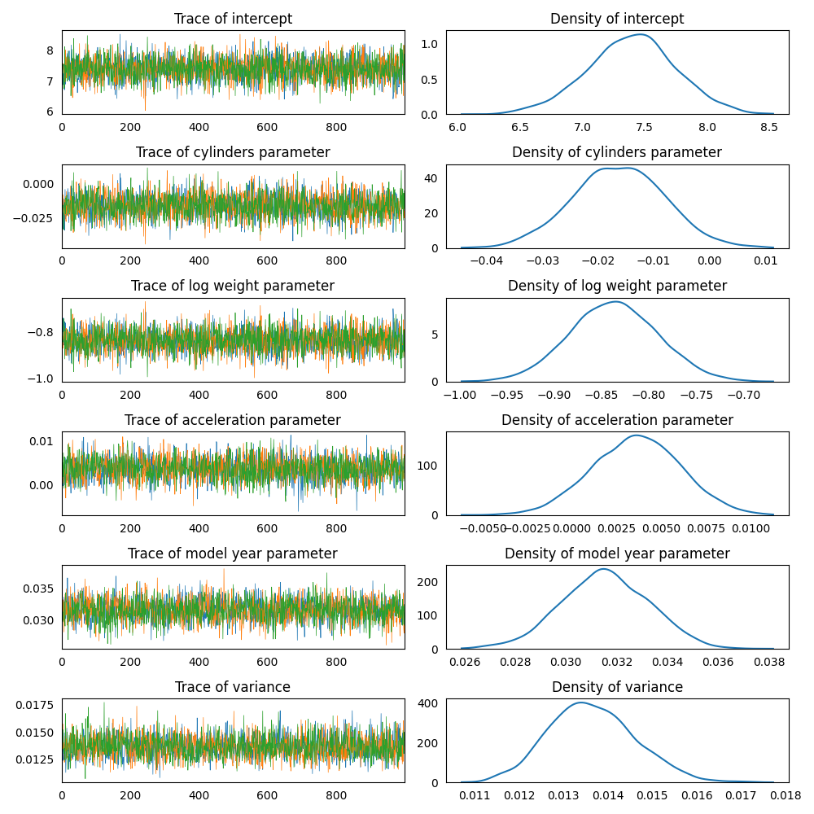
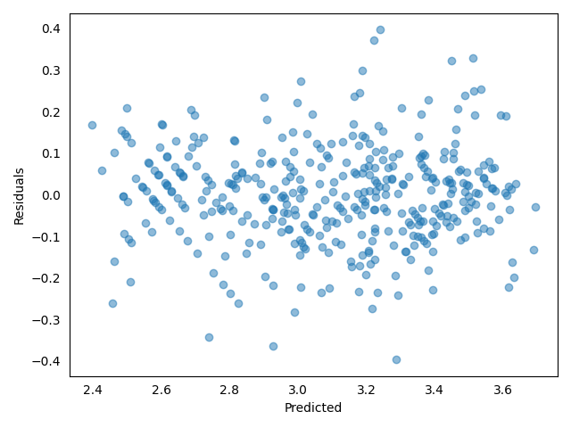

### Model Set Up

Determine the effect of car attributes on fuel consumption.  
[Link to the dataset](https://github.com/AndreaBlengino/baypy/blob/master/examples/auto_mpg/data/data.csv)  
[Dataset original source](https://archive.ics.uci.edu/dataset/9/auto+mpg)

> The data concerns city-cycle fuel consumption in miles per gallon, to 
  be predicted in terms of 3 multivalued discrete and 5 continuous 
  attributes.  
  Quinlan, 1993

```python
import pandas as pd

data = pd.read_csv(r'data/data.csv')
data.dropna(inplace = True)
```

Data exploration:

```python
import matplotlib.pyplot as plt

pd.plotting.scatter_matrix(frame = data, figsize = (10, 10))

plt.tight_layout()

plt.show()
```

<p align="center">
    
</p>

The scatterplot shows that *horsepower*, *displacement* and *weight* 
are strongly correlated among each other, meaning that they cannot be 
used as *independent* regressors. For this reason, *horsepower* and 
*displacement* are discarded, keeping *weight* as regressor.   
Moreover, *mpg* and *weight* are not normally distributed: data are 
skewed toward low values. For this reason, these columns are transformed
to log-scale:

```python
data['log mpg'] = np.log(data['mpg'])
data['log weight'] = np.log(data['weight'])
```

Set-up a linear regression model, considering *cylinders*, *log weight*,
*acceleration* and *model year* as the regressors and *log mpg* as the 
response variable.  
Using non-informative priors for regressors and variance:

```python
import baypy as bp

model = bp.model.LinearModel()
model.data = data
model.response_variable = 'log mpg'
model.priors = {'intercept': {'mean': 0, 'variance': 1e6},
                'cylinders': {'mean': 0, 'variance': 1e6},
                'log weight': {'mean': 0, 'variance': 1e6},
                'acceleration': {'mean': 0, 'variance': 1e6},
                'model year': {'mean': 0, 'variance': 1e6},
                'variance': {'shape': 1, 'scale': 1e-6}}
```

### Sampling

Run the regression sampling on 3 Markov chains, with 1000 iterations per 
each chain and discarding the first 50 burn-in draws:

```python
regression = bp.regression.LinearRegression(model = model)
posteriors = regression.sample(n_iterations = 1000, burn_in_iterations = 50, 
                              n_chains = 3, seed = 137)
```

### Convergence Diagnostics

Asses the model convergence diagnostics:

```python
bp.diagnostics.effective_sample_size(posteriors = posteriors)
```
```
                       intercept  cylinders  log weight  acceleration  model year  variance
Effective Sample Size    2873.12    2754.12     2685.45       2510.45     2338.35   2818.65
```

```python
bp.diagnostics.autocorrelation_summary(posteriors = posteriors)
```
```
        intercept  cylinders  log weight  acceleration  model year  variance
Lag 0    1.000000   1.000000    1.000000      1.000000    1.000000  1.000000
Lag 1   -0.037663  -0.017715   -0.034716      0.032738   -0.012336  0.002950
Lag 5    0.020242   0.002023    0.009178      0.015885    0.037428 -0.035680
Lag 10  -0.001631  -0.007542   -0.017864     -0.009563    0.019790  0.031953
Lag 30  -0.023641  -0.010533   -0.026705      0.005014    0.002749  0.021754
```

```python
bp.diagnostics.autocorrelation_plot(posteriors = posteriors)
```

<p align="center">
    
</p>

All diagnostics show a low correlation, indicating the chains 
converged to the stationary distribution.

### Posteriors Analysis

Asses posterior analysis:

```python
bp.analysis.trace_plot(posteriors = posteriors)
```

<p align="center">
    
</p>

Traces are good, incidating draws from the stationary distribution.

```python
bp.analysis.residuals_plot(posteriors = posteriors, data = data, response_variable = 'y')
```

<p align="center">
    
</p>

Also the residuals plot is good: no evidence for patterns, shapes or 
outliers.

```python
bp.analysis.summary(posteriors = posteriors)
```
```
Number of chains:           3
Sample size per chian:   1000

Empirical mean, standard deviation, 95% HPD interval for each variable:

                  Mean        SD   HPD min   HPD max
intercept     7.396536  0.355956  6.645237  8.071871
cylinders    -0.016291  0.008272 -0.033670 -0.001302
log weight   -0.837066  0.046627 -0.928362 -0.746617
acceleration  0.003610  0.002505 -0.001175  0.008532
model year    0.031550  0.001735  0.028306  0.035048
variance      0.013651  0.000981  0.011704  0.015532

Quantiles for each variable:

                  2.5%       25%       50%       75%     97.5%
intercept     6.673473  7.168108  7.401501  7.626908  8.105342
cylinders    -0.032550 -0.021880 -0.016244 -0.010672  0.000010
log weight   -0.927876 -0.868419 -0.837485 -0.805797 -0.746021
acceleration -0.001315  0.001901  0.003640  0.005298  0.008422
model year    0.028102  0.030384  0.031521  0.032740  0.034908
variance      0.011840  0.012967  0.013594  0.014286  0.015681
```

The summary reports a statistical evidence for:

- negative effect of *cylinders*: an increase of 1 cylinder would 
result in a percent decrease of $e^{-0.016291} - 1 = -1.62%$ in *mpg*
- negative effect of *log weight*: a percent increase of 10% in *weight* 
would result in a percent descrease of $1.1^{-0.837066} - 1 = -7.67%$ in
*mpg*
- positive effect of *model year*: an increase of 1 year would result in
an increase of 0.03 points in *mpg*. This effect may represent the 
efficiency enhancements made along the years to reduce fuel consumption  
