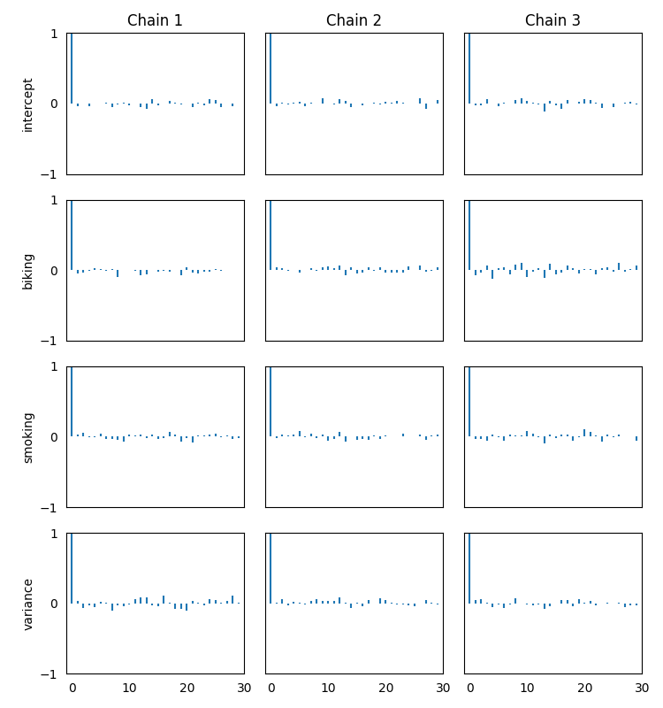
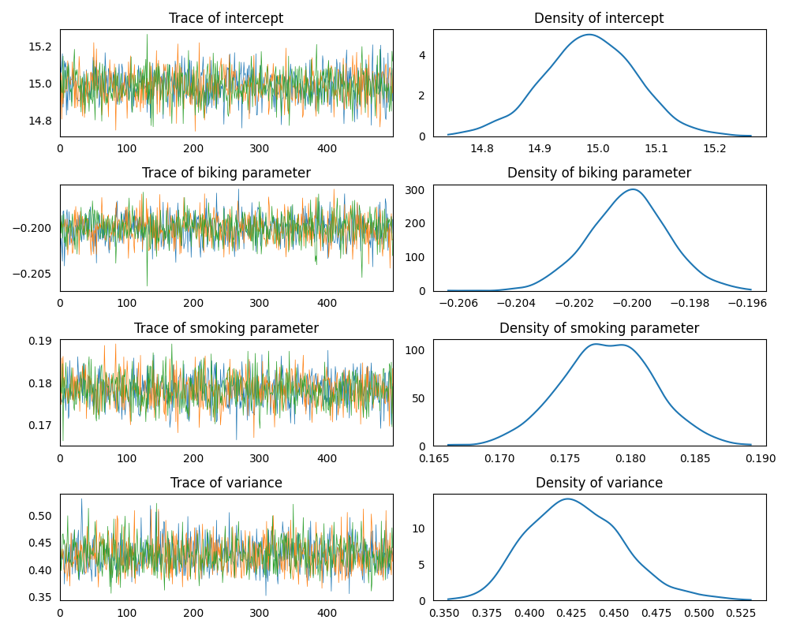
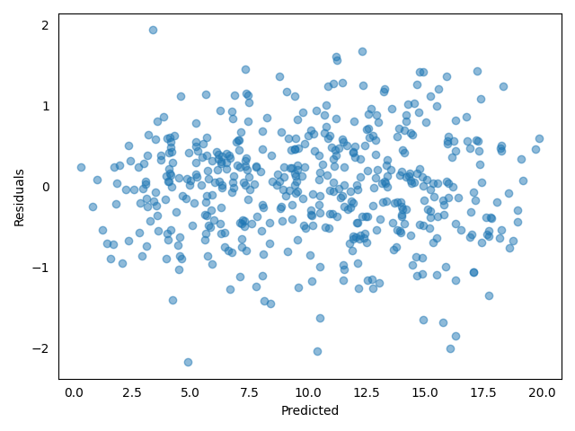

### Model Set Up

Pretending to fit the [heart dataset](ehttps://github.com/AndreaBlengino/GibbsSampler/blob/master/examples/heart/data.csv):

```python
import pandas as pd

data = pd.read_csv(r'data.csv')
```

Setting-up a linear regression model, using non-informative priors for
regressors and variance:

```python
import baypy as bp

model = bp.model.LinearModel()

model.data = data
model.response_variable = 'heart disease'
model.priors = {'intercept': {'mean': 0, 'variance': 1e6},
                'biking': {'mean': 0, 'variance': 1e9},
                'smoking': {'mean': 0, 'variance': 1e9},
                'variance': {'shape': 1, 'scale': 1e-9}}
```

### Sampling

Run the regression sampling on 3 Markov chains and discarding the first 
burn-in draws:

```python
regression = bp.regression.LinearRegression(model = model)
posteriors = regression.sample(n_iterations = 500, burn_in_iterations = 50, 
                               n_chains = 3, seed = 137)
```

### Convergence Diagnostics

Asses the model convergence diagnostics:

```python
bp.diagnostics.effective_sample_size(posteriors = posteriors)
```
```
                       intercept  biking  smoking  variance
Effective Sample Size    1456.14  1357.8  1242.45   1182.23
```

```python
bp.diagnostics.autocorrelation_summary(posteriors = posteriors)
```
```
        intercept    biking   smoking  variance
Lag 0    1.000000  1.000000  1.000000  1.000000
Lag 1   -0.035702 -0.030386 -0.005538  0.029446
Lag 5   -0.002354  0.004302  0.038233  0.000475
Lag 10   0.003016 -0.013481  0.016623  0.004290
Lag 30   0.030952  0.002635  0.043764 -0.010863
```

```python
bp.diagnostics.autocorrelation_plot(posteriors = posteriors)
```

<p align="center">
    
</p>

### Posteriors Analysis

Asses posterior analysis:

```python
bp.analysis.trace_plot(posteriors = posteriors)
```

<p align="center">
    
</p>

```python
bp.analysis.residuals_plot(posteriors = posteriors, data = data, response_variable = 'y')
```

<p align="center">
    
</p>

```python
bp.analysis.summary(posteriors = posteriors)
```
```
Number of chains:           3
Sample size per chian:    500

Empirical mean, standard deviation, 95% HPD interval for each variable:

                Mean        SD    HPD min    HPD max
intercept  14.985846  0.079870  14.828688  15.143414
biking     -0.200165  0.001396  -0.203008  -0.197700
smoking     0.178305  0.003526   0.170718   0.184603
variance    0.428741  0.027626   0.379180   0.481603

Quantiles for each variable:

                2.5%        25%        50%        75%      97.5%
intercept  14.831346  14.932129  14.984797  15.040651  15.148851
biking     -0.202870  -0.201129  -0.200194  -0.199177  -0.197511
smoking     0.171375   0.175875   0.178331   0.180618   0.185389
variance    0.381039   0.409852   0.427476   0.445582   0.486702
```

```python
bp.analysis.compute_DIC(posteriors = posteriors, data = data, response_variable = 'y')
```
```
Deviance at posterior means            -0.36
Posterior mean deviance                -2.31
Effective number of parameteres        -1.95
Deviace Information Criterion          -4.27
```
