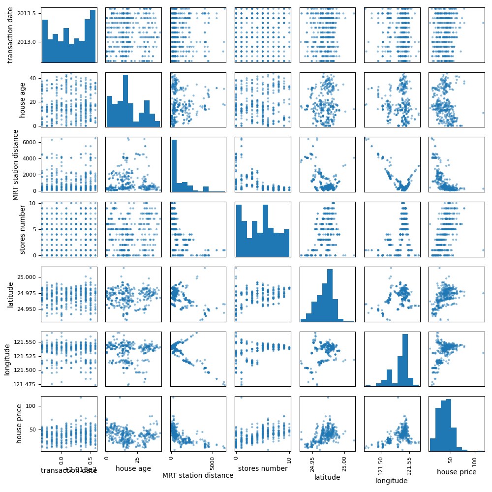
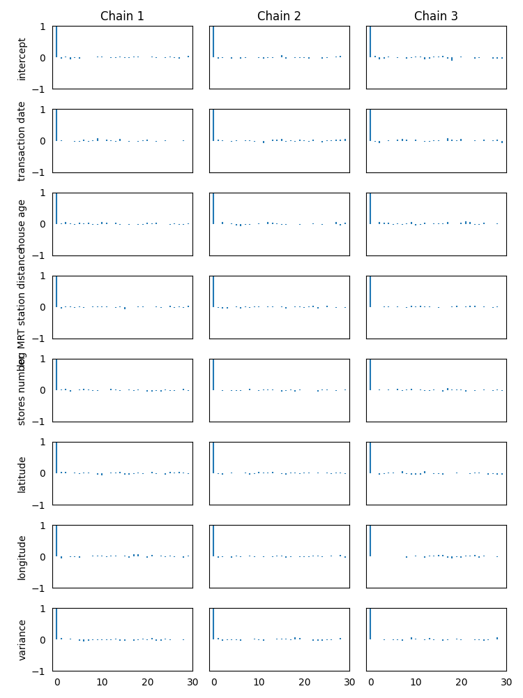
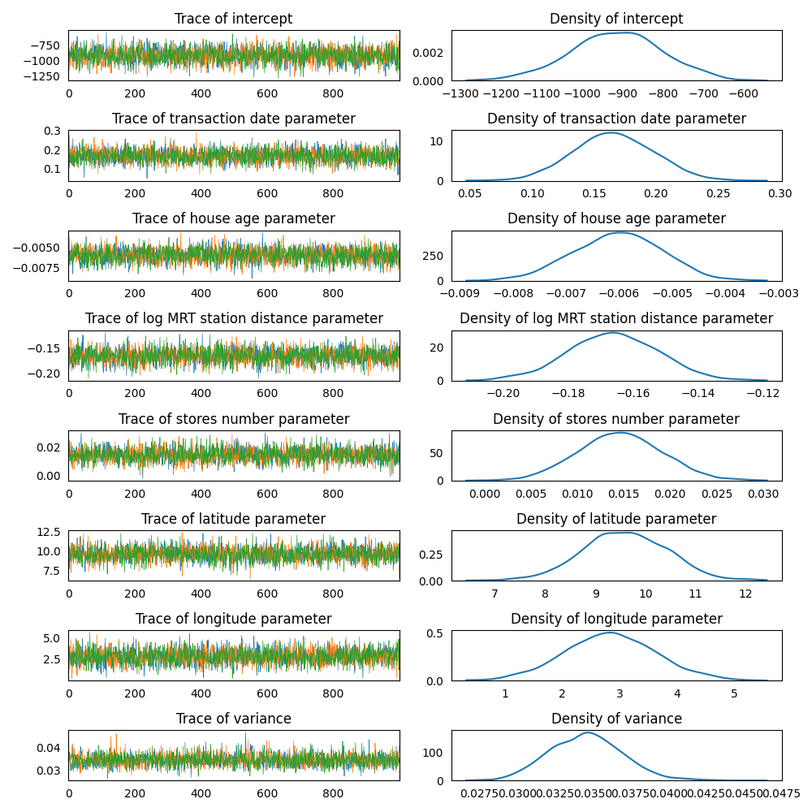
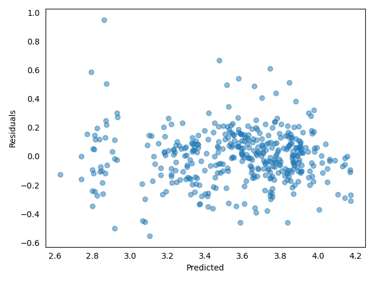

### Model Set Up

Determine the price of houses by their features.  
The market historical data set of real estate valuation are collected 
from Sindian Dist., New Taipei City, Taiwan.  
[Link to the dataset](https://github.com/AndreaBlengino/baypy/blob/master/examples/real_estate/data/data.csv)  
[Dataset original source](https://archive.ics.uci.edu/dataset/477/real+estate+valuation+data+set)

```python
import pandas as pd

data = pd.read_csv(r'data/data.csv')
data.drop(columns = ['No'], inplace = True)
data.columns = [' '.join(col.split(' ')[1:]) for col in data.columns]
data.rename(columns = {'distance to the nearest MRT station': 'MRT station distance',
                       'number of convenience stores': 'stores number',
                       'house price of unit area': 'house price'},
            inplace = True)
```

Data exploration:

```python
import matplotlib.pyplot as plt

pd.plotting.scatter_matrix(frame = data, figsize = (10, 10))

plt.tight_layout()

plt.show()
```

<p align="center">
    
</p>

The scatterplot shows no strong correlation among regressors.   
There are two ouliers in *house price*, one under 80 and the other over 
100, that do not follow the rest of distributions. For this reason, the
outlier are removed.  
*house price* and *MRT station distance* are not normally distributed: 
data are skewed toward high values. For this reason, these columns are 
transformed to log-scale:

```python
import numpy as np

data = data[(data['house price'] > 8) & (data['house price'] < 115)]
data['log house price'] = np.log(data['house price'])
data['log MRT station distance'] = np.log(data['MRT station distance'])
```

Set-up a linear regression model, considering *transaction date*, 
*house age*, *log MRT station distance*, *stores number*, *latitude* and
*longitude* as the regressors and *log house price* as the response 
variable.  
Using non-informative priors for regressors and variance:

```python
from baypy.model import LinearModel
import baypy as bp

model = LinearModel()
model.data = data
model.response_variable = 'log house price'
model.priors = {'intercept': {'mean': 0, 'variance': 1e6},
                'transaction date': {'mean': 0, 'variance': 1e6},
                'house age': {'mean': 0, 'variance': 1e6},
                'log MRT station distance': {'mean': 0, 'variance': 1e6},
                'stores number': {'mean': 0, 'variance': 1e6},
                'latitude': {'mean': 0, 'variance': 1e6},
                'longitude': {'mean': 0, 'variance': 1e6},
                'variance': {'shape': 1, 'scale': 1e-6}}
```

### Sampling

Run the regression sampling on 3 Markov chains, with 1000 iterations per 
each chain and discarding the first 50 burn-in draws:

```python
from baypy.regression import LinearRegression

LinearRegression.sample(model = model, n_iterations = 1000, 
                        burn_in_iterations = 50, n_chains = 3, seed = 137)
```

### Convergence Diagnostics

Asses the model convergence diagnostics:

```python
bp.diagnostics.effective_sample_size(posteriors = model.posteriors)
```
```
                       intercept  transaction date  house age  log MRT station distance  stores number  latitude  longitude  variance
Effective Sample Size    2767.17           2833.16    2548.86                   2877.61        2630.62   2770.24    2753.23   2778.72
```

```python
bp.diagnostics.autocorrelation_summary(posteriors = model.posteriors)
```
```
        intercept  transaction date  house age  log MRT station distance  stores number  latitude  longitude  variance
Lag 0    1.000000          1.000000   1.000000                  1.000000       1.000000  1.000000   1.000000  1.000000
Lag 1   -0.009739         -0.000259   0.000069                 -0.027052       0.001308  0.009574  -0.028492  0.034033
Lag 5   -0.004870         -0.010960  -0.017678                  0.010558       0.003372 -0.004647  -0.003221 -0.029635
Lag 10   0.014359          0.003361   0.009231                  0.013320      -0.012113 -0.017253   0.016727 -0.000938
Lag 30  -0.000886          0.031398  -0.030163                 -0.027021       0.004524  0.000075  -0.034411 -0.043168
```

```python
bp.diagnostics.autocorrelation_plot(posteriors = model.posteriors)
```

<p align="center">
    
</p>

All diagnostics show a low correlation, indicating the chains 
converged to the stationary distribution.

### Posteriors Analysis

Asses posterior analysis:

```python
bp.analysis.trace_plot(posteriors = model.posteriors)
```

<p align="center">
    
</p>

Traces are good, incidating draws from the stationary distribution.

```python
bp.analysis.residuals_plot(model = model)
```

<p align="center">
    
</p>

Also the residuals plot is good: no evidence for patterns, shapes or 
outliers.

```python
bp.analysis.summary(posteriors = model.posteriors)
```
```
Number of chains:           3
Sample size per chian:   1000

Empirical mean, standard deviation, 95% HPD interval for each variable:

                                Mean          SD      HPD min     HPD max
intercept                -914.144001  114.532293 -1140.625297 -689.444488
transaction date            0.165923    0.032401     0.102919    0.227775
house age                  -0.006024    0.000831    -0.007647   -0.004449
log MRT station distance   -0.166081    0.013939    -0.192367   -0.137433
stores number               0.014637    0.004559     0.005655    0.023409
latitude                    9.593946    0.851219     7.979301   11.251111
longitude                   2.840717    0.797554     1.193730    4.361885
variance                    0.034584    0.002446     0.029867    0.039150

Quantiles for each variable:

                                 2.5%         25%         50%         75%       97.5%
intercept                -1145.639542 -989.823076 -913.067376 -837.985390 -693.822181
transaction date             0.104168    0.144264    0.165367    0.187846    0.229589
house age                   -0.007658   -0.006587   -0.006004   -0.005448   -0.004454
log MRT station distance    -0.194091   -0.175519   -0.166026   -0.156556   -0.138945
stores number                0.005802    0.011556    0.014616    0.017608    0.023622
latitude                     7.933698    9.032735    9.583895   10.176279   11.219930
longitude                    1.262242    2.303130    2.840166    3.366287    4.466213
variance                     0.030052    0.032863    0.034565    0.036164    0.039478
```

The summary reports a statistical evidence for:

- positive effect of *transaction date*: $1$ month increase would 
result in $e^{\frac{0.165923}{12}} - 1 = 1.4\\%$ percent increase in 
*house price*
- negative effect of *house age*: $1$ year increase would result
in $e^{-0.006024} - 1 = -0.6\\%$ percent decrease in *house price*
- negative effect of *log MRT station distance*: $10\\%$ percent 
increase in *MRT station distance* would result in 
$1.10^{-0.166081} - 1 = -1.57\\%$ percent decrease in *house price*
- positive effect of *stores number*: $1$ store increase would 
result in $e^{0.014637} - 1 = 1.47\\%$ percent increase in *house price*
- positive effect of *latitute*: $1'$ increase would result in 
$e^{\frac{9.593946}{60}} - 1 = 17.3\\%$ percent increase *house price*
- positive effect of *longitude*: $1'$ increase would result in 
$e^{\frac{2.840717}{60}} - 1 = 4.85\\%$ percent increase in *house 
price*

The combined effect of *latitude* and *longitude* suggest that the 
north-east of New Taipei City is the most expensive area, while the
south-west is the most cheap area.
