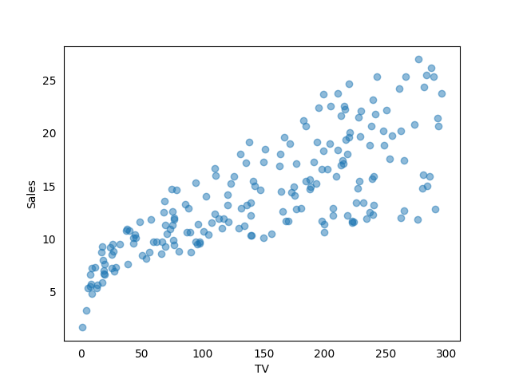
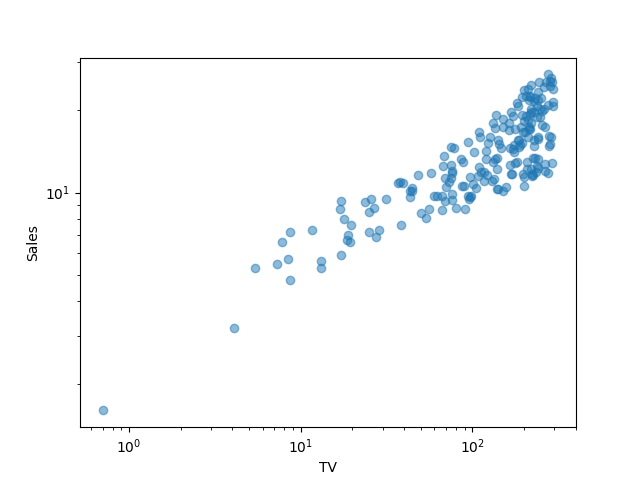
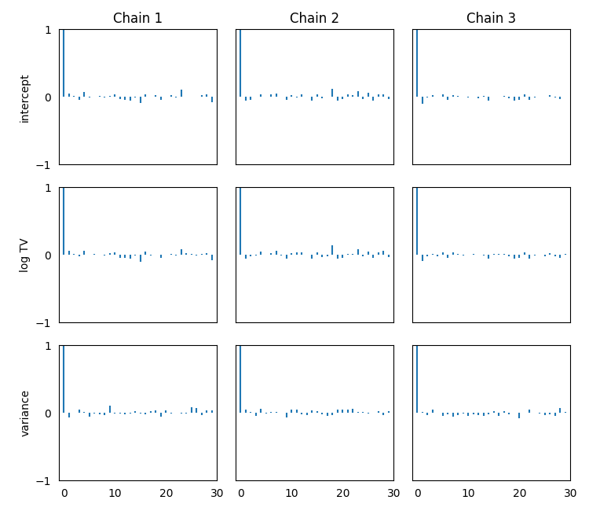
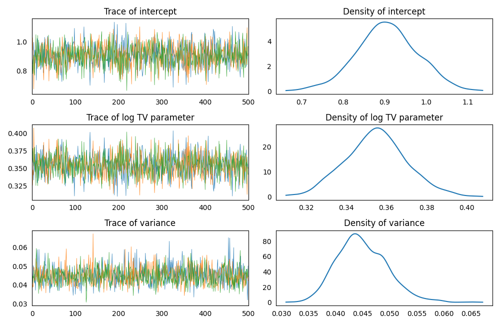
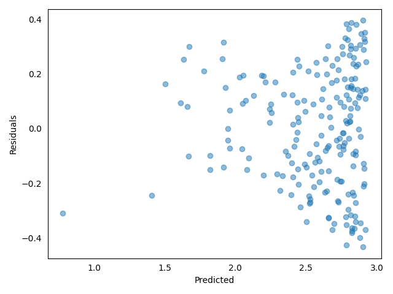
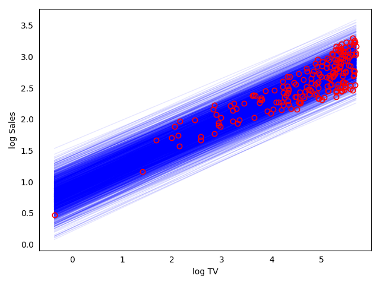
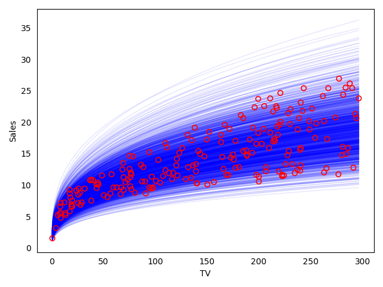

### Model Set Up

Pretending to fit the [tvmarketing dataset](https://github.com/AndreaBlengino/GibbsSampler/blob/master/examples/tvmarketing/data.csv):

```python
import numpy as np
import pandas as pd

np.random.seed(137)
data = pd.read_csv(r'data.csv')
```

```python
import matplotlib.pyplot as plt

fig_1, ax_1 = plt.subplots()

ax_1.plot(data['TV'].values, data['Sales'].values, marker = 'o', linestyle = '', alpha = 0.5)

ax_1.set_xlabel('TV')
ax_1.set_ylabel('Sales')

ax_1.tick_params(bottom = False, top = False, left = False, right = False)

plt.show()
```

<p align="center">
    
</p>

Data `Sales` does not follow a linear relationship with respect to `TV`.  
Try to check using the log-scale:

```python
fig_2, ax_2 = plt.subplots()

ax_2.loglog(data['TV'].values, data['Sales'].values, marker = 'o', linestyle = '', alpha = 0.5)

ax_2.set_xlabel('TV')
ax_2.set_ylabel('Sales')

plt.show()
```

<p align="center">
    
</p>

In the log-scale the relationship is almost linear, se we can transform
data:

```python
data['log TV'] = np.log(data['TV'])
data['log Sales'] = np.log(data['Sales'])
```

Setting-up a linear regression model, using non-informative priors for
regressors and variance:

```python
import GibbsSampler as gs

model = gs.model.LinearModel()

model.data = data
model.response_variable = 'log Sales'
model.priors = {'intercept': {'mean': 0, 'variance': 1e6},
                'log TV': {'mean': 0, 'variance': 1e6},
                'variance': {'shape': 1, 'scale': 1e-6}}
```

### Sampling

Run the regression sampling on 3 Markov chains and discarding the first 
burn-in draws:

```python
regression = gs.regression.LinearRegression(model = model)
posteriors = regression.sample(n_iterations = 500, burn_in_iterations = 50, n_chains = 3)
```

### Convergence Diagnostics

Asses the model convergence diagnostics:

```python
gs.diagnostics.effective_sample_size(posteriors = posteriors)
```
```
                       intercept   log TV  variance
Effective Sample Size    1373.29  1321.11   1424.68
```

```python
gs.diagnostics.autocorrelation_summary(posteriors = posteriors)
```
```
        intercept    log TV  variance
Lag 0    1.000000  1.000000  1.000000
Lag 1   -0.032124 -0.027163  0.001298
Lag 5    0.011421  0.014532 -0.032781
Lag 10   0.021877  0.021076 -0.004669
Lag 30  -0.028748 -0.030245  0.031090
```

```python
gs.diagnostics.autocorrelation_plot(posteriors = posteriors)
```

<p align="center">
    
</p>

### Posteriors Analysis

Asses posterior analysis:

```python
gs.analysis.trace_plot(posteriors = posteriors)
```

<p align="center">
    
</p>

```python
gs.analysis.residuals_plot(posteriors = posteriors, data = data, response_variable = 'y')
```

<p align="center">
    
</p>

```python
gs.analysis.summary(posteriors = posteriors)
```
```
Number of chains:           3
Sample size per chian:    500

Empirical mean, standard deviation, 95% HPD interval for each variable:

               Mean        SD   HPD min   HPD max
intercept  0.905983  0.073676  0.768024  1.057664
log TV     0.354768  0.015388  0.325168  0.384996
variance   0.044953  0.004674  0.035855  0.053536

Quantiles for each variable:

               2.5%       25%       50%       75%     97.5%
intercept  0.754455  0.858332  0.905386  0.952843  1.050115
log TV     0.325689  0.344946  0.354906  0.364422  0.386279
variance   0.036865  0.041706  0.044504  0.048087  0.054838
```

```python
gs.analysis.compute_DIC(posteriors = posteriors, data = data, response_variable = 'y')
```
```
Deviance at posterior means          -448.84
Posterior mean deviance              -450.63
Effective number of parameteres        -1.79
Deviace Information Criterion        -452.42
```

Comparing data to fitted model posteriors:

```python
data_tmp = pd.DataFrame()
for posterior, posterior_sample in posteriors.items():
    data_tmp[posterior] = np.asarray(posterior_sample).reshape(-1)
data_tmp['error'] = np.random.normal(loc = 0, scale = np.sqrt(data_tmp['variance']), size = len(data_tmp))

x = np.linspace(data['log TV'].min(), data['log TV'].max(), 50)


fig_3, ax_3 = plt.subplots()

for row in zip(*data_tmp.to_dict('list').values()):
    y = row[0] + row[1]*x + row[3]
    ax_3.plot(x, y, color = 'blue', linewidth = 1, alpha = 0.1)
ax_3.plot(data['log TV'].values, data['log Sales'].values, marker = 'o', linestyle = '',
        markerfacecolor = 'none', markeredgecolor = 'red', markeredgewidth = 1.2)

ax_3.set_xlabel('log TV')
ax_3.set_ylabel('log Sales')
ax_3.tick_params(bottom = False, top = False, left = False, right = False)

plt.tight_layout()

plt.show()
```

<p align="center">
    
</p>

```python
fig_4, ax_4 = plt.subplots()

for row in zip(*data_tmp.to_dict('list').values()):
    y = row[0] + row[1]*x + row[3]
    ax_4.plot(np.exp(x), np.exp(y), color = 'blue', linewidth = 1, alpha = 0.1)
ax_4.plot(data['TV'].values, data['Sales'].values, marker = 'o', linestyle = '',
        markerfacecolor = 'none', markeredgecolor = 'red', markeredgewidth = 1.2)

ax_4.set_xlabel('TV')
ax_4.set_ylabel('Sales')
ax_4.tick_params(bottom = False, top = False, left = False, right = False)

plt.tight_layout()

plt.show()
```

<p align="center">
    
</p>