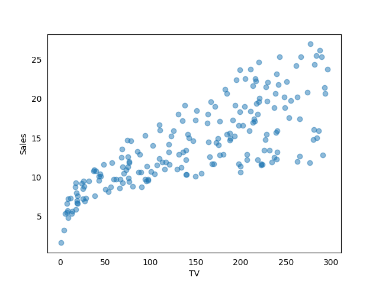
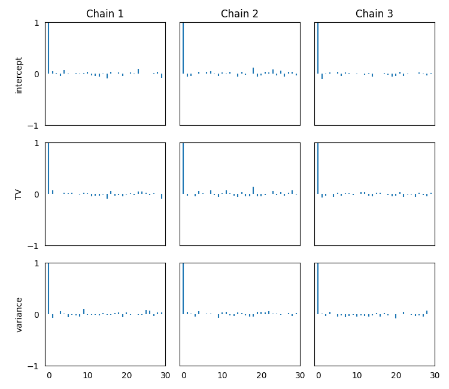
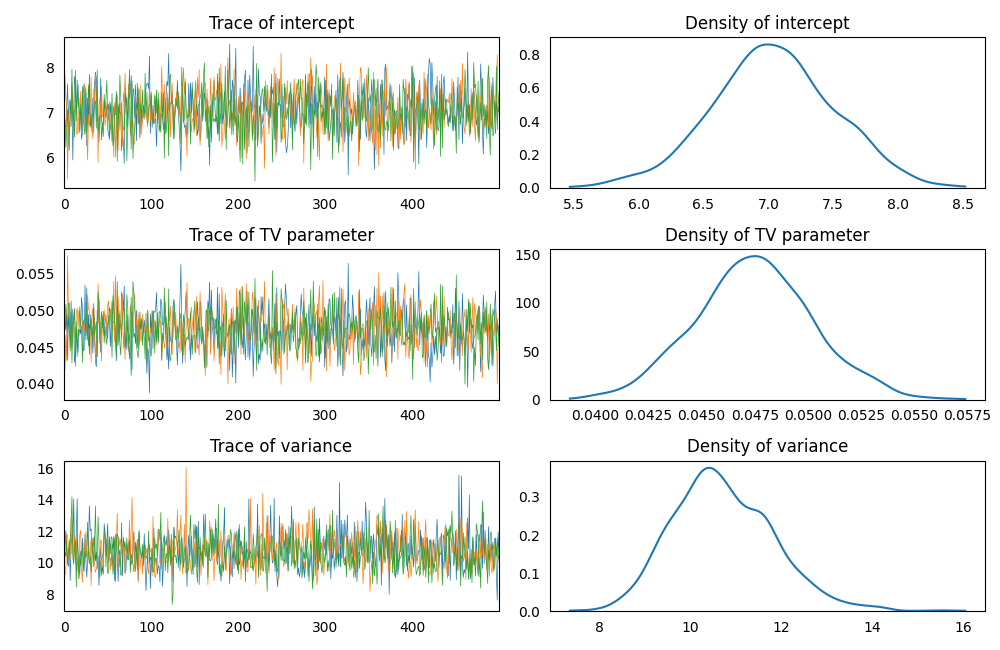
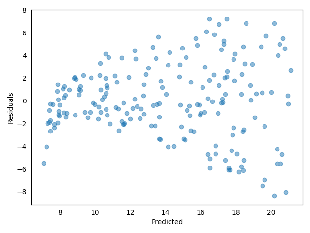
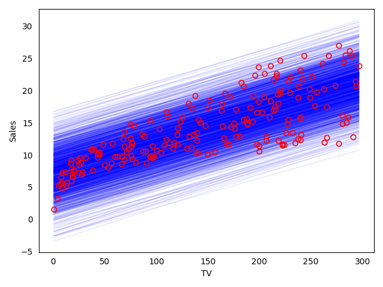
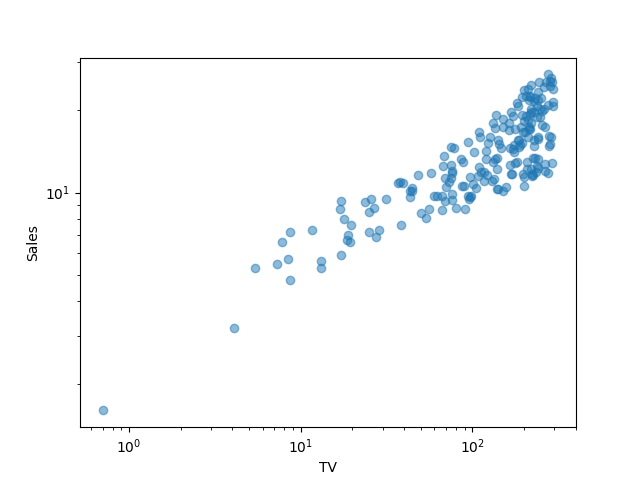
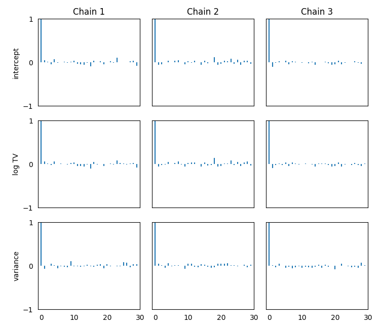
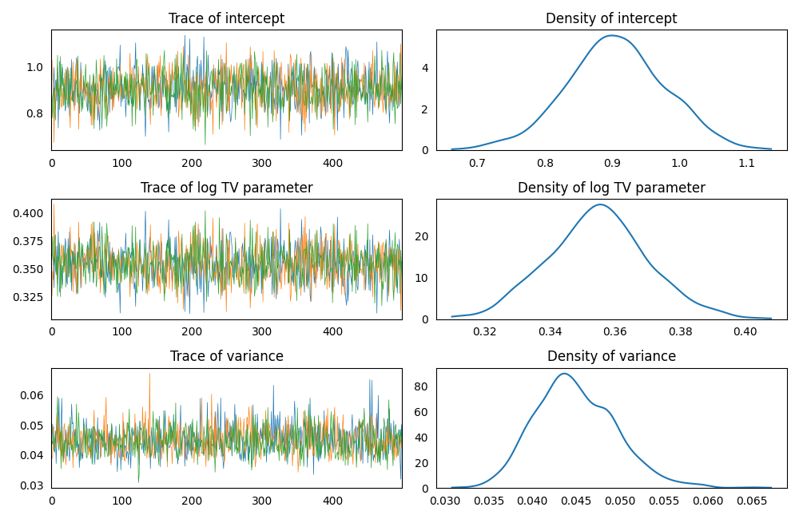
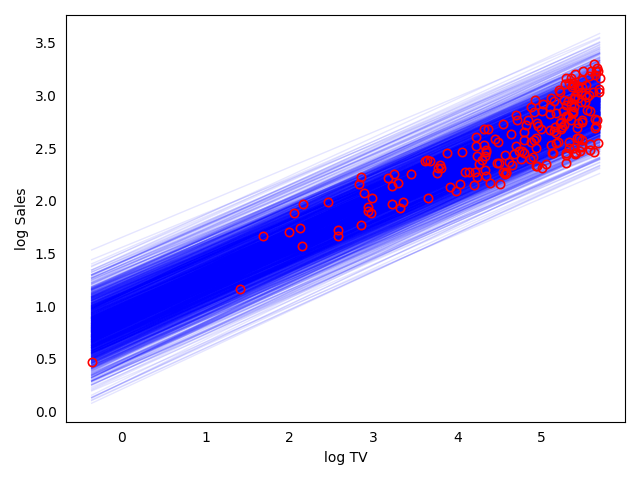
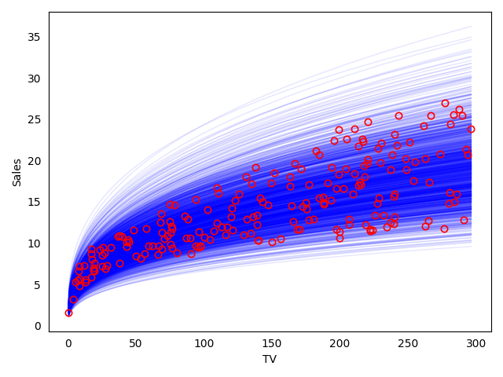

### Model Set Up

Build a linear regression model for predicting *Sales* using *TV* as a
predictor.  
[Link to the dataset](https://github.com/AndreaBlengino/baypy/blob/master/examples/tvmarketing/data/data.csv)  
Unfortunately, [the database original source](https://www.kaggle.com/datasets/devzohaib/tvmarketingcsv?select=tvmarketing.csv)
does not report the units on each variable.

```python
import pandas as pd

data = pd.read_csv(r'data/data.csv')
```

```python
import matplotlib.pyplot as plt

fig_1, ax_1 = plt.subplots()

ax_1.plot(data['TV'].values, data['Sales'].values, marker = 'o', linestyle = '', alpha = 0.5)

ax_1.set_xlabel('TV')
ax_1.set_ylabel('Sales')

ax_1.tick_params(bottom = False, top = False, left = False, right = False)

plt.show()
```

<p align="center">
    
</p>

*Sales* do not follow a perfect linear relationship with respet to 
*TV*, but let's try to fit a linear model anyway.  
Set-up a linear regression model, considering *TV* as regressor and 
*Sales* as the response variable.  
Use non-informative priors for regressor and variance:

```python
import baypy as bp

model_1 = bp.model.LinearModel()

model_1.data = data
model_1.response_variable = 'Sales'
model_1.priors = {'intercept': {'mean': 0, 'variance': 1e6},
                  'TV': {'mean': 0, 'variance': 1e6},
                  'variance': {'shape': 1, 'scale': 1e-6}}
```

### Sampling

Run the regression sampling on 3 Markov chains, with 500 iterations per 
each chain and discarding the first 50 burn-in draws:

```python
regression_1 = bp.regression.LinearRegression(model = model_1)
posteriors_1 = regression_1.sample(n_iterations = 500, burn_in_iterations = 50, 
                                   n_chains = 3, seed = 137)
```

### Convergence Diagnostics

Asses the model convergence diagnostics:

```python
bp.diagnostics.effective_sample_size(posteriors = posteriors_1)
```
```
                       intercept       TV  variance
Effective Sample Size    1371.51  1280.94   1428.17
```

```python
bp.diagnostics.autocorrelaion_summary(posteriors = posteriors_1)
```
```
        intercept        TV  variance
Lag 0    1.000000  1.000000  1.000000
Lag 1   -0.032025 -0.010411  0.000142
Lag 5    0.011572  0.015856 -0.033278
Lag 10   0.021948  0.010220 -0.003107
Lag 30  -0.028900 -0.023383  0.032368
```

```python
bp.diagnostics.autocorrelation_plot(posteriors = posteriors_1)
```

<p align="center">
    
</p>

All diagnostics show a low correlation, indicating the chains 
converged to the stationary distribution.

### Posteriors Analysis

Asses posterior analysis:

```python
bp.analysis.trace_plot(posteriors = posteriors_1)
```

<p align="center">
    
</p>

```python
bp.analysis.residuals_plot(posteriors = posteriors_1, data = data, response_variable = 'Sales')
```

<p align="center">
    
</p>

Residuals form a shape and increase as the predicted variable increses. 
This suggests that the model does not fit the data well.  
This is consistent with previous exploration of the data: there is no 
pure linear relationship between *Sales* and *TV*.  
Comparing data to fitted model posteriors:

```python
import numpy as np

posteriors_data = pd.DataFrame()
for posterior, posterior_sample in posteriors_1.items():
    posteriors_data[posterior] = np.asarray(posterior_sample).reshape(-1)
posteriors_data['error 1'] = np.random.normal(loc = 0, scale = np.sqrt(posteriors_data['variance']), size = len(posteriors_data))

tv_1 = np.linspace(data['TV'].min(), data['TV'].max(), 50)


fig_2, ax_2 = plt.subplots()

for row in zip(*posteriors_data.to_dict('list').values()):
    sales_1 = row[0] + row[1]*tv_1 + row[3]
    ax_2.plot(tv_1, sales_1, color = 'blue', linewidth = 1, alpha = 0.1)
ax_2.plot(data['TV'].values, data['Sales'].values, marker = 'o', linestyle = '',
          markerfacecolor = 'none', markeredgecolor = 'red', markeredgewidth = 1.2)

ax_2.set_xlabel('TV')
ax_2.set_ylabel('Sales')
ax_2.tick_params(bottom = False, top = False, left = False, right = False)

plt.tight_layout()

plt.show()
```

<p align="center">
    
</p>

The posterior distribution is rather broad and includes all the data 
without identifying their true trend. Notice that some posteriors 
predict negative *Sales* for low values of *TV*.

### Alternative Model Set Up

Try to check a relationship using the log-scale:

```python
fig_3, ax_3 = plt.subplots()

ax_3.loglog(data['TV'].values, data['Sales'].values, marker = 'o', linestyle = '', alpha = 0.5)

ax_3.set_xlabel('TV')
ax_3.set_ylabel('Sales')

plt.show()
```

<p align="center">
    
</p>

The relationship is almost linear in the log-scale. Notice that most of
the data are concentrated toward high values of *TV*.  
Try to fit a linear model in the log-scale; it is required to transform 
the data:

```python
data['log TV'] = np.log(data['TV'])
data['log Sales'] = np.log(data['Sales'])
```

Set-up a linear regression model, considering *log TV* as regressor and 
*log Sales* as the response variable.   
Use non-informative priors for regressor and variance:

```python
model_2 = bp.model.LinearModel()

model_2.data = data
model_2.response_variable = 'log Sales'
model_2.priors = {'intercept': {'mean': 0, 'variance': 1e6},
                  'log TV': {'mean': 0, 'variance': 1e6},
                  'variance': {'shape': 1, 'scale': 1e-6}}
```

### Sampling

Run the regression sampling on 3 Markov chains, with 500 iteration per 
each chain and discarding the first 50 burn-in draws:

```python
regression_2 = bp.regression.LinearRegression(model = model_2)
posteriors_2 = regression_2.sample(n_iterations = 500, burn_in_iterations = 50, 
                                   n_chains = 3, seed = 137)
```

### Convergence Diagnostics

Asses the model convergence diagnostics:

```python
bp.diagnostics.effective_sample_size(posteriors = posteriors_2)
```
```
                       intercept   log TV  variance
Effective Sample Size    1373.29  1321.11   1428.17
```

```python
bp.diagnostics.autocorrelation_summary(posteriors = posteriors_2)
```
```
        intercept    log TV  variance
Lag 0    1.000000  1.000000  1.000000
Lag 1   -0.032124 -0.027163  0.000142
Lag 5    0.011421  0.014532 -0.033278
Lag 10   0.021877  0.021076 -0.003107
Lag 30  -0.028748 -0.030245  0.032368
```

```python
bp.diagnostics.autocorrelation_plot(posteriors = posteriors_2)
```

<p align="center">
    
</p>

All diagnostics show a low correlation, indicating the chains 
converged to the stationary distribution.

### Posteriors Analysis

Asses posterior analysis:

```python
bp.analysis.trace_plot(posteriors = posteriors_2)
```

<p align="center">
    
</p>

```python
bp.analysis.residuals_plot(posteriors = posteriors_2, data = data, response_variable = 'log Sales')
```

<p align="center">
    
</p>

Residuals are generally improved with respect to the original model.  
Residuals appear to reflect an increasing dispersion as predicted 
variabl increase. However, as already mentioned, notice that most of the
data are concentrated toward high values of *TV*. The slight growing 
pattern is partially caused by this data heterogeneity. 

```python
bp.analysis.summary(posteriors = posteriors_2)
```
```
Number of chains:           3
Sample size per chian:    500

Empirical mean, standard deviation, 95% HPD interval for each variable:

               Mean        SD   HPD min   HPD max
intercept  0.905983  0.073676  0.768024  1.057664
log TV     0.354768  0.015388  0.325168  0.384996
variance   0.044958  0.004671  0.035855  0.053536

Quantiles for each variable:

               2.5%       25%       50%       75%     97.5%
intercept  0.754455  0.858332  0.905386  0.952843  1.050115
log TV     0.325689  0.344946  0.354906  0.364422  0.386279
variance   0.036865  0.041719  0.044506  0.048087  0.054838
```

The summary reports a statistical evidence for a positive effect of 
*log TV*: $10\\%$ percent increase in *TV* would result in
$1.10^{0.354768} - 1 = 3.44\\%$ percent increase in *Sales*.  
Comparing data to fitted model posteriors:

```python
posteriors_data = pd.DataFrame()
for posterior, posterior_sample in posteriors_2.items():
    posteriors_data[posterior] = np.asarray(posterior_sample).reshape(-1)
posteriors_data['error 2'] = np.random.normal(loc = 0, scale = np.sqrt(posteriors_data['variance']), size = len(posteriors_data))

log_tv_2 = np.linspace(data['log TV'].min(), data['log TV'].max(), 50)


fig_4, ax_4 = plt.subplots()

for row in zip(*posteriors_data.to_dict('list').values()):
    log_sales_2 = row[0] + row[1]*log_tv_2 + row[3]
    ax_4.plot(log_tv_2, log_sales_2, color = 'blue', linewidth = 1, alpha = 0.1)
ax_4.plot(data['log TV'].values, data['log Sales'].values, marker = 'o', linestyle = '',
          markerfacecolor = 'none', markeredgecolor = 'red', markeredgewidth = 1.2)

ax_4.set_xlabel('log TV')
ax_4.set_ylabel('log Sales')
ax_4.tick_params(bottom = False, top = False, left = False, right = False)

plt.tight_layout()

plt.show()
```

<p align="center">
    
</p>

```python
fig_5, ax_5 = plt.subplots()

for row in zip(*posteriors_data.to_dict('list').values()):
    log_sales_2 = row[0] + row[1]*log_tv_2 + row[3]
    ax_5.plot(np.exp(log_tv_2), np.exp(log_sales_2), color = 'blue', linewidth = 1, alpha = 0.1)
ax_5.plot(data['TV'].values, data['Sales'].values, marker = 'o', linestyle = '',
          markerfacecolor = 'none', markeredgecolor = 'red', markeredgewidth = 1.2)

ax_5.set_xlabel('TV')
ax_5.set_ylabel('Sales')
ax_5.tick_params(bottom = False, top = False, left = False, right = False)

plt.tight_layout()

plt.show()
```

<p align="center">
    
</p>

The alternative model's posteriors catch in a better way the trend of 
the data and take into account data dispersion.  
For completeness, compare the two models using the *DIC*:

```python
bp.analysis.compute_DIC(posteriors = posteriors_1, data = data, response_variable = 'Sales')
```
```
Deviance at posterior means           646.21
Posterior mean deviance               644.42
Effective number of parameteres        -1.79
Deviace Information Criterion         642.63
```
```python
bp.analysis.compute_DIC(posteriors = posteriors_2, data = data, response_variable = 'log Sales')
```
```
Deviance at posterior means          -448.84
Posterior mean deviance              -450.63
Effective number of parameteres        -1.79
Deviace Information Criterion        -452.42
```

*DIC* is lower for the alternative model, indicating a preference for 
the alternative model in log-scale.
